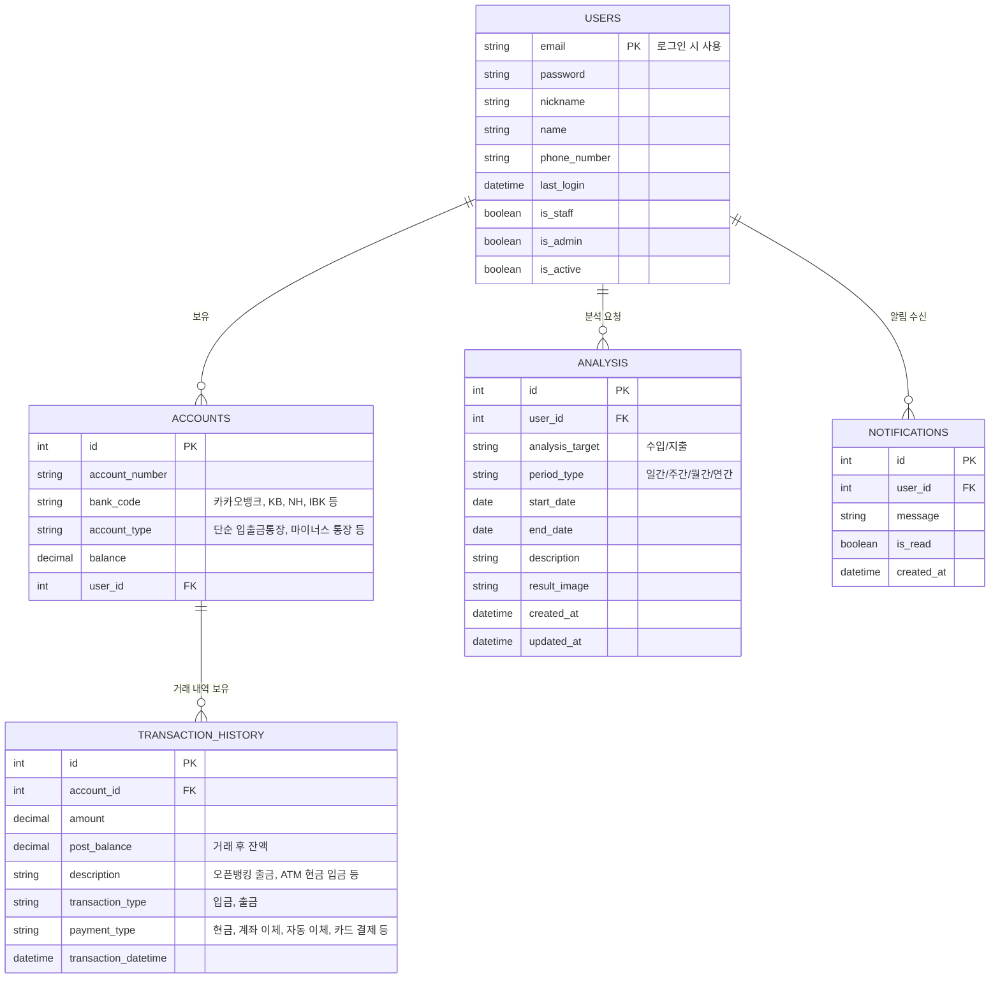
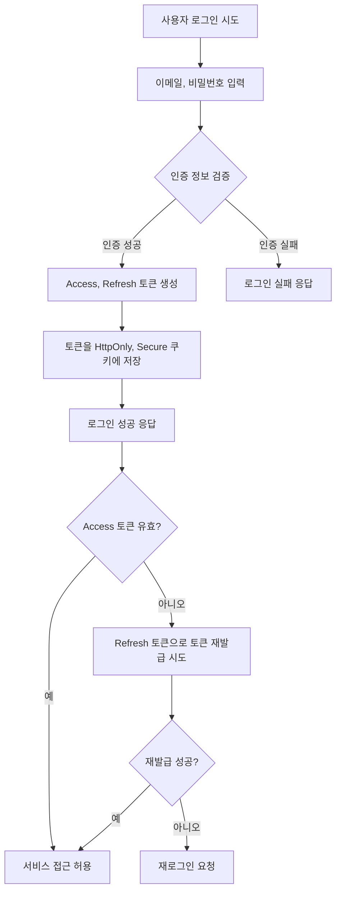

# Django Financial Project

## 프로젝트 개요
- Django 기반 개인 금융 관리 서비스
- 사용자 계좌, 거래 내역, 분석, 알림 등을 관리
- Docker + Docker Compose 환경에서 실행 가능

---

# 데이터베이스 ERD



# 플로우 차트: 사용자 인증 흐름
<details>
<summary>펼쳐보기</summary>
<div markdown="1">


</div>
</details>

# 📖 API 명세서


**users/** : 회원가입/로그인/토큰/내 정보 관리  
**accounts/** : 계좌 관리  
**analysis/analysis/** : 분석 데이터  
**analysis/transactions/** : 거래내역 관리  
**notifications/** : 알림 관리  

---

<details>
<summary>📂 전체 API 문서 (펼쳐보기)</summary>

---

<details>
<summary>1. 인증 & 사용자 관리 (Users & Auth)</summary>

### 🔹 회원가입
POST /api/users/register/
Content-Type: application/json

```json
요청:
{ "email": "user@test.com", "password": "비밀번호", "name": "홍길동" }
```
```json
응답: `201 Created`
{ "id": "uuid", "email": "user@test.com", "is_active": false }
```
```undefined
curl -X POST {{base_url}}/api/users/register/
-H "Content-Type: application/json"
-d '{"email":"user@test.com","password":"비밀번호","name":"홍길동"}'
```

---

### 🔹 로그인
POST /api/users/login/
Content-Type: application/json

```json
요청:
{ "email": "user@test.com", "password": "비밀번호" }
```
```json
응답:
{
    "msg": "Login success",
    "refresh": "<jwt_refresh>",
    "access": "<jwt_access>"
}
```
```undefined
curl -X POST {{base_url}}/api/users/login/
-H "Content-Type: application/json"
-d '{"email":"user@test.com","password":"비밀번호"}'
```

---

### 🔹 토큰 재발급
POST /api/users/token/refresh/

```json
요청:
{ "refresh": "<refresh_token>" }
```
```json
응답:
{ "access": "<new_access_token>" }
```
```undefined
curl -X POST {{base_url}}/api/users/token/refresh/
-H "Content-Type: application/json"
-d '{"refresh":"<refresh_token>"}'
```

---

### 🔹 내 정보 조회
GET /api/users/me/
Authorization: Bearer <access_token>

```undefined
curl -X GET {{base_url}}/api/users/me/
-H "Authorization: Bearer <access_token>"
```

---

### 🔹 로그아웃
POST /api/users/logout/
Authorization: Bearer <access_token>

```undefined
curl -X POST {{base_url}}/api/users/logout/
-H "Authorization: Bearer <access_token>"
```

</details>

---

<details>
<summary>2. 계좌 관리 (Accounts)</summary>

### 🔹 계좌 목록 조회
GET /api/accounts/

Authorization: Bearer <access_token>

```json
응답:
[
    {
        "id": "uuid",
        "name": "카카오뱅크",
        "number": "123-456-789",
        "currency": "KRW",
        "balance": "100000.00",
        "status": "ACTIVE"
    }
]
```
```undefined
curl -X GET {{base_url}}/api/accounts/
-H "Authorization: Bearer <access_token>"
```


---

### 🔹 계좌 생성
POST /api/accounts/

Content-Type: application/json

Authorization: Bearer <access_token>

```json
요청:
{ "name": "카카오뱅크", "number": "123-456-789", "currency": "KRW" }
```
```undefined
curl -X POST {{base_url}}/api/accounts/
-H "Authorization: Bearer <access_token>"
-H "Content-Type: application/json"
-d '{"name":"카카오뱅크","number":"123-456-789","currency":"KRW"}'
```


---

### 🔹 특정 계좌 조회
GET /api/accounts/{id}/

Authorization: Bearer <access_token>

```undefined
curl -X GET {{base_url}}/api/accounts/{id}/
-H "Authorization: Bearer <access_token>"
```

---

### 🔹 계좌 삭제
DELETE /api/accounts/{id}/

```undefined
curl -X DELETE {{base_url}}/api/accounts/{id}/
-H "Authorization: Bearer <access_token>"
```

</details>

---

<details>
<summary>3. 거래 내역 (Transactions)</summary>

`/api/analysis/transactions/`

### 🔹 거래 내역 조회
GET /api/analysis/transactions/?tx_type=DEPOSIT&ordering=-occurred_at

- 필터링 지원 : `tx_type`, `amount__gte`, `occurred_at__lte`, `account`  
- 정렬 : `ordering=amount` or `ordering=-occurred_at`  
- 검색 : `?search=급여`

```undefined
curl -X GET "{{base_url}}/api/analysis/transactions/?tx_type=DEPOSIT&ordering=-occurred_at"
-H "Authorization: Bearer <access_token>"
```


---

### 🔹 거래 내역 생성
POST /api/analysis/transactions/

Content-Type: application/json

Authorization: Bearer <access_token>

```json
요청:
    {
        "account": "uuid",
        "tx_type": "DEPOSIT",
        "amount": "50000.00",
        "currency": "KRW",
        "description": "급여 입금"
    }
```
```undefined
curl -X POST {{base_url}}/api/analysis/transactions/
-H "Authorization: Bearer <access_token>"
-H "Content-Type: application/json"
-d '{"account":"uuid","tx_type":"DEPOSIT","amount":"50000.00","currency":"KRW","description":"급여 입금"}'
```


---

### 🔹 단일 거래
GET /api/analysis/transactions/{id}/

PUT /api/analysis/transactions/{id}/

PATCH /api/analysis/transactions/{id}/

DELETE /api/analysis/transactions/{id}/


</details>

---

<details>
<summary>4. 분석 Report (Analysis)</summary>

`/api/analysis/analysis/`

### 🔹 분석 생성
POST /api/analysis/analysis/

Content-Type: application/json

Authorization: Bearer <access_token>

```json
{
    "analysis_target": "EXPENSE",
    "period_type": "MONTHLY",
    "start_date": "2025-07-01",
    "end_date": "2025-07-31",
    "description": "7월 지출 분석"
}
```
```undefined
curl -X POST {{base_url}}/api/analysis/analysis/
-H "Authorization: Bearer <access_token>"
-H "Content-Type: application/json"
-d '{"analysis_target":"EXPENSE","period_type":"MONTHLY","start_date":"2025-07-01","end_date":"2025-07-31","description":"7월 지출 분석"}'
```


---

### 🔹 분석 조회
GET /api/analysis/analysis/?period_type=MONTHLY&analysis_target=INCOME

```undefined
curl -X GET "{{base_url}}/api/analysis/analysis/?period_type=MONTHLY"
-H "Authorization: Bearer <access_token>"
```


---

### 🔹 단일 분석 상세
GET /api/analysis/analysis/{id}/

```undefined
curl -X GET {{base_url}}/api/analysis/analysis/{id}/
-H "Authorization: Bearer <access_token>"
```

</details>

---

<details>
<summary>5. 알림 (Notification)</summary>

`/api/notifications/`

### 🔹 안 읽은 알림 목록
GET /api/notifications/unread/

Authorization: Bearer <access_token>

```json
응답:
[
    {
        "id": 1,
        "message": "새로운 거래 발생",
        "is_read": false,
        "created_at": "2025-08-30T15:00:00Z"
    }
]
```
```undefined
curl -X GET {{base_url}}/api/notifications/unread/
-H "Authorization: Bearer <access_token>"
```


---

### 🔹 알림 읽음 처리
POST /api/notifications/read/{id}/

Authorization: Bearer <access_token>

```json
응답:
{"detail": "알림 읽음 처리 완료"}
```
```undefined
curl -X POST {{base_url}}/api/notifications/read/1/
-H "Authorization: Bearer <access_token>"
```


</details>

---

<details>
<summary>6. Swagger & Redoc</summary>

Swagger UI : GET /swagger/

Redoc : GET /redoc/

```undefined
curl -X GET {{base_url}}/swagger/
curl -X GET {{base_url}}/redoc/
```

</details>

---

</details>