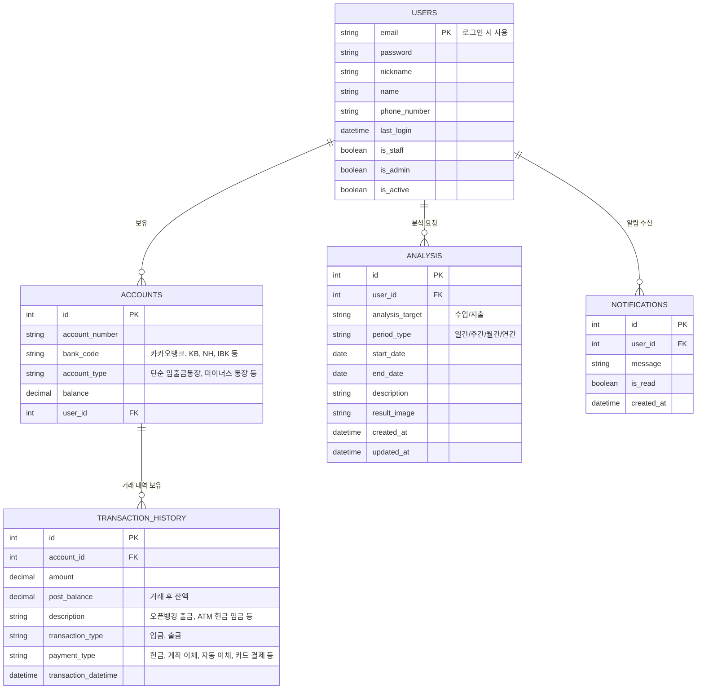
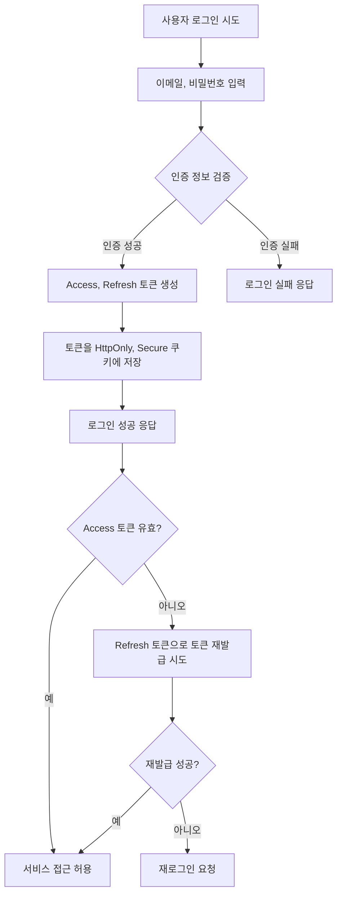

# Django Financial Project

## 프로젝트 개요
- Django 기반 개인 금융 관리 서비스
- 사용자 계좌, 거래 내역, 분석, 알림 등을 관리
- Docker + Docker Compose 환경에서 실행 가능

---

## 데이터베이스 ERD

```mermaid
erDiagram
    USERS {
        string email PK "로그인 시 사용"
        string password
        string nickname
        string name
        string phone_number
        datetime last_login
        boolean is_staff
        boolean is_admin
        boolean is_active
    }
    ACCOUNTS {
        int id PK
        string account_number
        string bank_code "카카오뱅크, KB, NH, IBK 등"
        string account_type "단순 입출금통장, 마이너스 통장 등"
        decimal balance
        int user_id FK
    }
    TRANSACTION_HISTORY {
        int id PK
        int account_id FK
        decimal amount
        decimal post_balance "거래 후 잔액"
        string description "오픈뱅킹 출금, ATM 현금 입금 등"
        string transaction_type "입금, 출금"
        string payment_type "현금, 계좌 이체, 자동 이체, 카드 결제 등"
        datetime transaction_datetime
    }
    ANALYSIS {
        int id PK
        int user_id FK
        string analysis_target "수입/지출"
        string period_type "일간/주간/월간/연간"
        date start_date
        date end_date
        string description
        string result_image
        datetime created_at
        datetime updated_at
    }
    NOTIFICATIONS {
        int id PK
        int user_id FK
        string message
        boolean is_read
        datetime created_at
    }

    USERS ||--o{ ACCOUNTS : "보유"
    ACCOUNTS ||--o{ TRANSACTION_HISTORY : "거래 내역 보유"
    USERS ||--o{ ANALYSIS : "분석 요청"
    USERS ||--o{ NOTIFICATIONS : "알림 수신"

```

## 플로우 차트: 사용자 인증 흐름

```mermaid
flowchart TD
    A[사용자 로그인 시도] --> B[이메일, 비밀번호 입력]
    B --> C{인증 정보 검증}
    C -- 인증 성공 --> D[Access, Refresh 토큰 생성]
    D --> E[토큰을 HttpOnly, Secure 쿠키에 저장]
    E --> F[로그인 성공 응답]
    C -- 인증 실패 --> G[로그인 실패 응답]
    F --> H{Access 토큰 유효?}
    H -- 예 --> I[서비스 접근 허용]
    H -- 아니오 --> J[Refresh 토큰으로 토큰 재발급 시도]
    J --> K{재발급 성공?}
    K -- 예 --> I
    K -- 아니오 --> L[재로그인 요청]
```