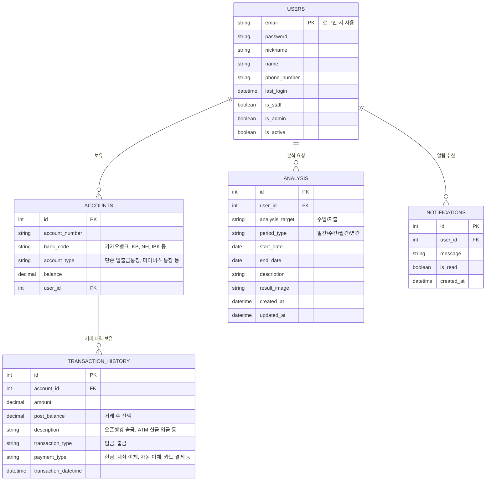

## 데이터베이스 ERD

```mermaid
erDiagram
    USERS {
        string email PK "로그인 시 사용"
        string password
        string nickname
        string name
        string phone_number
        datetime last_login
        boolean is_staff
        boolean is_admin
        boolean is_active
    }
    ACCOUNTS {
        int id PK
        string account_number
        string bank_code "카카오뱅크, KB, NH, IBK 등"
        string account_type "단순 입출금통장, 마이너스 통장 등"
        decimal balance
        int user_id FK
    }
    TRANSACTION_HISTORY {
        int id PK
        int account_id FK
        decimal amount
        decimal post_balance "거래 후 잔액"
        string description "오픈뱅킹 출금, ATM 현금 입금 등"
        string transaction_type "입금, 출금"
        string payment_type "현금, 계좌 이체, 자동 이체, 카드 결제 등"
        datetime transaction_datetime
    }
    ANALYSIS {
        int id PK
        int user_id FK
        string analysis_target "수입/지출"
        string period_type "일간/주간/월간/연간"
        date start_date
        date end_date
        string description
        string result_image
        datetime created_at
        datetime updated_at
    }
    NOTIFICATIONS {
        int id PK
        int user_id FK
        string message
        boolean is_read
        datetime created_at
    }

    USERS ||--o{ ACCOUNTS : "보유"
    ACCOUNTS ||--o{ TRANSACTION_HISTORY : "거래 내역 보유"
    USERS ||--o{ ANALYSIS : "분석 요청"
    USERS ||--o{ NOTIFICATIONS : "알림 수신"
```