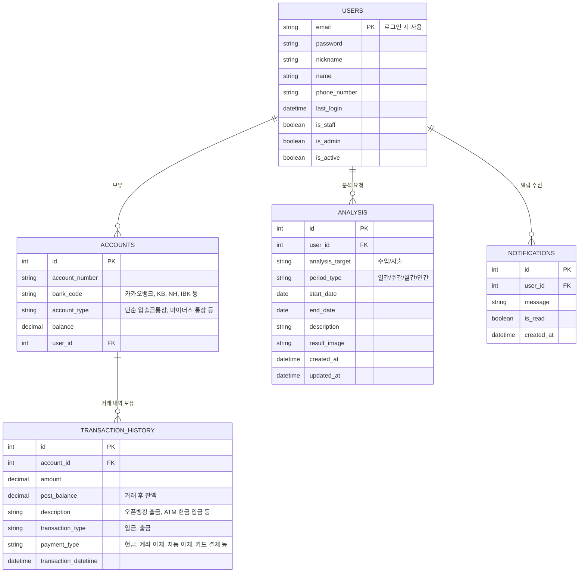
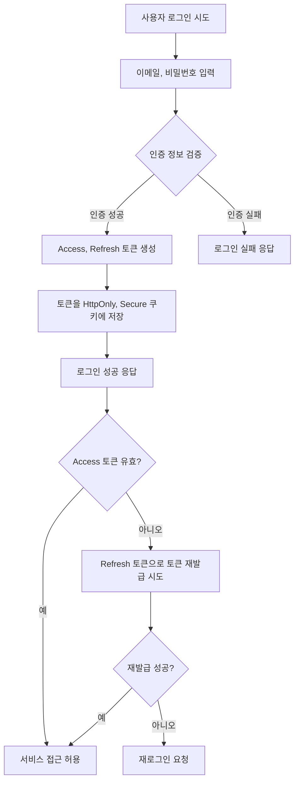

# Django Financial Project - API 문서

## 📜 프로젝트 개요

Django 기반 개인 금융 관리 서비스로, 사용자 계좌, 거래 내역, 분석, 알림 등을 관리합니다.  
Docker + Docker Compose 환경에서 실행 가능합니다.

---

## 📂 프로젝트 구조

<details>
<summary>프로젝트 구조 보기</summary>

```
django-financial/
├── .dockerignore
├── .env
├── .env.example
├── .gitattributes
├── .github/
│   └── workflows/
│       ├── build.yml
│       ├── deploy.yml
│       └── checks.yml
├── .gitignore
├── .gitmessage.txt
├── .pre-commit-config.yaml
├── apps/
│   ├── __init__.py
│   ├── accounts/
│   │   ├── __init__.py
│   │   ├── admin.py
│   │   ├── apps.py
│   │   ├── migrations/
│   │   ├── models.py
│   │   ├── serializers.py
│   │   ├── services.py
│   │   ├── tests.py
│   │   ├── urls.py
│   │   └── views.py
│   ├── analysis/
│   │   ├── __init__.py
│   │   ├── admin.py
│   │   ├── apps.py
│   │   ├── migrations/
│   │   ├── models.py
│   │   ├── serializers.py
│   │   ├── services.py
│   │   ├── signals.py
│   │   ├── tests.py
│   │   ├── urls.py
│   │   └── views.py
│   ├── core/
│   │   ├── __init__.py
│   │   ├── admin.py
│   │   ├── apps.py
│   │   ├── management/
│   │   │   └── commands/
│   │   │       └── wait_for_db.py
│   │   ├── migrations/
│   │   ├── models.py
│   │   ├── tests.py
│   │   └── views.py
│   ├── notification/
│   │   ├── __init__.py
│   │   ├── admin.py
│   │   ├── apps.py
│   │   ├── migrations/
│   │   ├── models.py
│   │   ├── serializers.py
│   │   ├── signals.py
│   │   ├── tests.py
│   │   ├── urls.py
│   │   └── views.py
│   └── users/
│       ├── __init__.py
│       ├── admin.py
│       ├── apps.py
│       ├── migrations/
│       ├── models.py
│       ├── serializers.py
│       ├── tests.py
│       ├── tokens.py
│       ├── urls.py
│       └── views.py
├── config/
│   ├── __init__.py
│   ├── asgi.py
│   ├── settings/
│   │   ├── __init__.py
│   │   ├── base.py
│   │   ├── dev.py
│   │   └── prod.py
│   ├── urls.py
│   └── wsgi.py
├── Dockerfile
├── docker-compose.yaml
├── manage.py
├── media/
├── pyproject.toml
├── pytest.ini
├── README.md
├── scripts/
│   └── run.sh
├── tests/
│   ├── __init__.py
│   ├── test_api.py
│   └── test_auth_flow.py
└── uv.lock
```

</details>

---

## 💾 ERD (Entity Relationship Diagram)

<details>
<summary>데이터베이스 구조 보기</summary>



</details>

---

## 📊 사용자 인증 플로우

<details>
<summary>인증 흐름 차트 보기</summary>



</details>

---

## 📖 API 명세서

**Base URL**: `{{base_url}}/api/`

### API 엔드포인트 개요

- **users/**: 회원가입/로그인/토큰/내 정보 관리
- **accounts/**: 계좌 관리
- **analysis/analysis/**: 분석 데이터
- **analysis/transactions/**: 거래내역 관리
- **notifications/**: 알림 관리

---

## 🔐 1. 인증 & 사용자 관리 (Users & Auth)

<details>
<summary>회원가입</summary>

### 🔹 회원가입
**POST** `/api/users/signup/`

**Content-Type**: `application/json`

**요청 본문**:
```json
{
    "email": "user@example.com",
    "password": "password123",
    "nickname": "string",
    "name": "string",
    "phone_number": "string"
}
```

**성공 응답 (201 Created)**: 사용자 정보 반환 (이메일 인증 필요)

**cURL 예시**:
```bash
curl -X POST {{base_url}}/api/users/signup/ \
-H "Content-Type: application/json" \
-d '{"email":"user@example.com","password":"password123","name":"홍길동","nickname":"hong","phone_number":"010-1234-5678"}'
```

</details>

<details>
<summary>이메일 인증</summary>

### 🔹 이메일 인증
**GET** `/api/users/verify-email/<uidb64>/<token>/`

**설명**: 이메일로 전송된 링크를 통해 계정을 활성화합니다.

**성공 응답 (200 OK)**:
```json
{
    "msg": "Email verified successfully"
}
```

**cURL 예시**:
```bash
curl -X GET {{base_url}}/api/users/verify-email/{uidb64}/{token}/
```

</details>

<details>
<summary>로그인</summary>

### 🔹 로그인
**POST** `/api/users/login/`

**Content-Type**: `application/json`

**요청 본문**:
```json
{
    "email": "user@example.com",
    "password": "password123"
}
```

**성공 응답 (200 OK)**: Access, Refresh 토큰을 포함한 응답과 함께 쿠키에 토큰 저장
```json
{
    "msg": "Login success",
    "refresh": "<jwt_refresh>",
    "access": "<jwt_access>"
}
```

**cURL 예시**:
```bash
curl -X POST {{base_url}}/api/users/login/ \
-H "Content-Type: application/json" \
-d '{"email":"user@example.com","password":"password123"}'
```

</details>

<details>
<summary>로그아웃</summary>

### 🔹 로그아웃
**POST** `/api/users/logout/`

**Authorization**: `Bearer <access_token>`

**설명**: 서버에 저장된 Refresh 토큰을 만료시키고, 클라이언트의 쿠키를 삭제합니다.

**성공 응답 (200 OK)**:
```json
{
    "msg": "Logout success"
}
```

**cURL 예시**:
```bash
curl -X POST {{base_url}}/api/users/logout/ \
-H "Authorization: Bearer <access_token>"
```

</details>

<details>
<summary>내 정보 관리</summary>

### 🔹 내 정보 관리
**GET, PUT, PATCH, DELETE** `/api/users/profile/`

**Authorization**: `Bearer <access_token>`

- **GET**: 현재 로그인된 사용자 정보 조회
- **PUT**: 사용자 정보 전체 수정
- **PATCH**: 사용자 정보 부분 수정
- **DELETE**: 사용자 계정 삭제

**cURL 예시**:
```bash
# 내 정보 조회
curl -X GET {{base_url}}/api/users/profile/ \
-H "Authorization: Bearer <access_token>"

# 내 정보 수정 (부분)
curl -X PATCH {{base_url}}/api/users/profile/ \
-H "Authorization: Bearer <access_token>" \
-H "Content-Type: application/json" \
-d '{"nickname":"새로운닉네임"}'
```

</details>

<details>
<summary>토큰 재발급</summary>

### 🔹 토큰 재발급
**POST** `/api/users/token/refresh/`

**Content-Type**: `application/json`

**요청 본문**:
```json
{
    "refresh": "<refresh_token>"
}
```

**성공 응답 (200 OK)**:
```json
{
    "access": "<new_access_token>"
}
```

**cURL 예시**:
```bash
curl -X POST {{base_url}}/api/users/token/refresh/ \
-H "Content-Type: application/json" \
-d '{"refresh":"<refresh_token>"}'
```

</details>

---

## 💳 2. 계좌 관리 (Accounts)

`viewsets.ModelViewSet`을 사용하여 계좌에 대한 CRUD API를 제공합니다.

<details>
<summary>계좌 목록 조회 및 생성</summary>

### 🔹 계좌 목록 조회
**GET** `/api/accounts/`

**Authorization**: `Bearer <access_token>`

**성공 응답**:
```json
[
    {
        "id": "uuid",
        "name": "카카오뱅크",
        "number": "123-456-789",
        "currency": "KRW",
        "balance": "100000.00",
        "status": "ACTIVE"
    }
]
```

### 🔹 계좌 생성
**POST** `/api/accounts/`

**Content-Type**: `application/json`  
**Authorization**: `Bearer <access_token>`

**요청 본문**:
```json
{
    "name": "카카오뱅크",
    "number": "123-456-789",
    "currency": "KRW"
}
```

**cURL 예시**:
```bash
# 계좌 목록 조회
curl -X GET {{base_url}}/api/accounts/ \
-H "Authorization: Bearer <access_token>"

# 계좌 생성
curl -X POST {{base_url}}/api/accounts/ \
-H "Authorization: Bearer <access_token>" \
-H "Content-Type: application/json" \
-d '{"name":"카카오뱅크","number":"123-456-789","currency":"KRW"}'
```

</details>

<details>
<summary>특정 계좌 조회, 수정, 삭제</summary>

### 🔹 특정 계좌 조회
**GET** `/api/accounts/{id}/`

### 🔹 특정 계좌 전체 수정
**PUT** `/api/accounts/{id}/`

### 🔹 특정 계좌 부분 수정
**PATCH** `/api/accounts/{id}/`

### 🔹 특정 계좌 삭제
**DELETE** `/api/accounts/{id}/`

**Authorization**: `Bearer <access_token>` (모든 요청에 필요)

**cURL 예시**:
```bash
# 특정 계좌 조회
curl -X GET {{base_url}}/api/accounts/{id}/ \
-H "Authorization: Bearer <access_token>"

# 계좌 삭제
curl -X DELETE {{base_url}}/api/accounts/{id}/ \
-H "Authorization: Bearer <access_token>"
```

</details>

---

## 📊 3. 분석 및 거래 내역 (Analysis & Transactions)

<details>
<summary>분석 데이터 관리</summary>

### 🔹 분석 데이터 관리
`viewsets.ModelViewSet`을 사용하여 분석 데이터에 대한 CRUD API를 제공합니다.

**GET, POST** `/api/analysis/analysis/`  
**GET, PUT, PATCH, DELETE** `/api/analysis/analysis/{id}/`

**Authorization**: `Bearer <access_token>`  
**필터링**: `period_type`, `analysis_target`

### 분석 생성 예시
**POST** `/api/analysis/analysis/`

**요청 본문**:
```json
{
    "analysis_target": "EXPENSE",
    "period_type": "MONTHLY",
    "start_date": "2025-07-01",
    "end_date": "2025-07-31",
    "description": "7월 지출 분석"
}
```

**cURL 예시**:
```bash
# 분석 목록 조회 (필터링)
curl -X GET "{{base_url}}/api/analysis/analysis/?period_type=MONTHLY&analysis_target=INCOME" \
-H "Authorization: Bearer <access_token>"

# 분석 생성
curl -X POST {{base_url}}/api/analysis/analysis/ \
-H "Authorization: Bearer <access_token>" \
-H "Content-Type: application/json" \
-d '{"analysis_target":"EXPENSE","period_type":"MONTHLY","start_date":"2025-07-01","end_date":"2025-07-31","description":"7월 지출 분석"}'
```

</details>

<details>
<summary>거래 내역 관리</summary>

### 🔹 거래 내역 관리
`viewsets.ModelViewSet`을 사용하여 거래 내역에 대한 CRUD API를 제공합니다.

**GET, POST** `/api/analysis/transactions/`  
**GET, PUT, PATCH, DELETE** `/api/analysis/transactions/{id}/`

**Authorization**: `Bearer <access_token>`

### 필터링 및 정렬 옵션
- **필터링**: `tx_type`, `amount` (gte, lte), `occurred_at` (gte, lte), `account`
- **정렬**: `amount`, `occurred_at`
- **검색**: `description`

### 거래 내역 생성 예시
**POST** `/api/analysis/transactions/`

**요청 본문**:
```json
{
    "account": "uuid",
    "tx_type": "DEPOSIT",
    "amount": "50000.00",
    "currency": "KRW",
    "description": "급여 입금"
}
```

**cURL 예시**:
```bash
# 거래 내역 조회 (필터링 및 정렬)
curl -X GET "{{base_url}}/api/analysis/transactions/?tx_type=DEPOSIT&ordering=-occurred_at" \
-H "Authorization: Bearer <access_token>"

# 거래 내역 생성
curl -X POST {{base_url}}/api/analysis/transactions/ \
-H "Authorization: Bearer <access_token>" \
-H "Content-Type: application/json" \
-d '{"account":"uuid","tx_type":"DEPOSIT","amount":"50000.00","currency":"KRW","description":"급여 입금"}'
```

</details>

---

## 🔔 4. 알림 (Notifications)

<details>
<summary>읽지 않은 알림 목록</summary>

### 🔹 읽지 않은 알림 목록
**GET** `/api/notifications/unread/`

**Authorization**: `Bearer <access_token>`

**설명**: 로그인한 사용자의 읽지 않은 알림을 최신순으로 조회합니다.

**성공 응답**:
```json
[
    {
        "id": 1,
        "message": "새로운 거래 발생",
        "is_read": false,
        "created_at": "2025-08-30T15:00:00Z"
    }
]
```

**cURL 예시**:
```bash
curl -X GET {{base_url}}/api/notifications/unread/ \
-H "Authorization: Bearer <access_token>"
```

</details>

<details>
<summary>알림 읽음 처리</summary>

### 🔹 알림 읽음 처리
**POST** `/api/notifications/read/{id}/`

**Authorization**: `Bearer <access_token>`

**설명**: 특정 ID의 알림을 읽음 상태로 변경합니다.

**성공 응답 (200 OK)**:
```json
{
    "detail": "알림 읽음 처리 완료"
}
```

**cURL 예시**:
```bash
curl -X POST {{base_url}}/api/notifications/read/1/ \
-H "Authorization: Bearer <access_token>"
```

</details>

---

## 📚 5. API 문서

<details>
<summary>Swagger & Redoc</summary>

### 🔹 API 문서 접근
- **Swagger UI**: `GET /swagger/`
- **Redoc**: `GET /redoc/`

**cURL 예시**:
```bash
curl -X GET {{base_url}}/swagger/
curl -X GET {{base_url}}/redoc/
```

</details>

---

## ⚙️ 환경 설정

<details>
<summary>Docker 실행</summary>

### Docker 환경에서 실행
```bash
# 환경변수 설정
cp .env.example .env

# Docker Compose로 실행
docker-compose up -d

# 마이그레이션 실행
docker-compose exec web python manage.py migrate

# 슈퍼유저 생성
docker-compose exec web python manage.py createsuperuser
```

</details>

---

## 📝 참고사항

- 모든 인증이 필요한 API는 `Authorization: Bearer <access_token>` 헤더가 필요합니다.
- 토큰은 HttpOnly, Secure 쿠키로도 관리됩니다.
- 모든 날짜/시간은 ISO 8601 형식을 사용합니다.
- 페이지네이션이 적용된 API는 `page`, `page_size` 파라미터를 지원합니다.